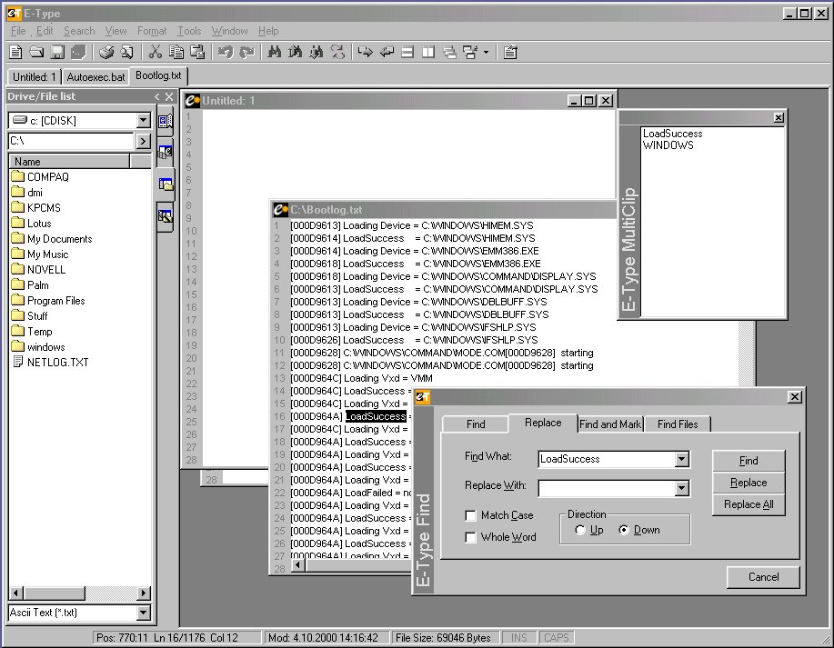



## E\-Type 0\.0\.78

### Description

Multi Document Text editor with many functions.

This is a project I started 18 months ago. It grew out of control and I now have realized I will probably never have time to finish it. Therefore I now release it for you guys to use.

All I ask is: If you use it for anything, let me know. The name is mine to use with a text editor.

The program is almost finished. A few bugs still have to be sorted out. Let me know if you find a solution for them.

Read the text file, E-Type.txt, included in the zipfile. It contains todolist and credits to the people, who I have ether got help from, ideas from or borrowed snippets from.
 
### More Info
 

             |
---                |---
**Submitted On**   |2001-03-20 14:51:36
**By**             |[Trond Sørensen](https://github.com/Planet-Source-Code/PSCIndex/blob/master/ByAuthor/trond-s-rensen.md)
**Level**          |Intermediate
**User Rating**    |4.8 (82 globes from 17 users)
**Compatibility**  |VB 6\.0
**Category**       |[Complete Applications](https://github.com/Planet-Source-Code/PSCIndex/blob/master/ByCategory/complete-applications__1-27.md)
**World**          |[Visual Basic](https://github.com/Planet-Source-Code/PSCIndex/blob/master/ByWorld/visual-basic.md)
**Archive File**   |[CODE\_UPLOAD173893212001\.zip](https://github.com/Planet-Source-Code/trond-s-rensen-e-type-0-0-78__1-21826/archive/master.zip)

